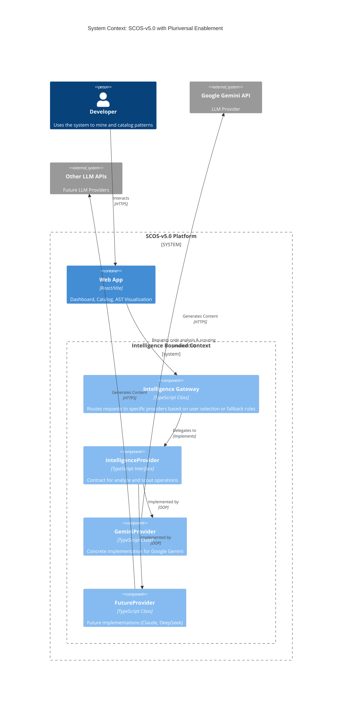

# ADR-004: Pluriversal Intelligence Enablement

## 1. Architecture Decision Record (ADR)

### Context
The current SCOS-v5.0 architecture tightly couples the `PatternCatalog` and `MinerDashboard` domains directly to a specific LLM vendor (Google Gemini) via `geminiService.ts`. This monolithic dependency creates a single point of failure and restricts cognitive diversity (the "Pluriversal Layer" objective in Phase 2). The system cannot seamlessly failover or route to alternative intelligence providers (e.g., Claude 3.5, DeepSeek R1). This coupling violates the dependency inversion principle and introduces unwarranted rigidity.

### Decision
We will enforce an **Intelligence Gateway Pattern** combined with a strict **Provider Strategy**. We introduce the `IntelligenceGateway` as the anti-corruption layer (ACL). The core business logic will depend solely on the `IntelligenceProvider` interface. Specific vendor implementations (e.g., `GeminiProvider`) will reside within the `providers/` boundary.

### Status
Accepted

### Consequences
**Positive Trade-offs:**
- Complete decoupling of application logic from third-party AI APIs.
- Enables immediate switching or routing across multiple models without UI or core logic changes.
- Eliminates "Vendor Lock-in" risk.

**Negative Trade-offs:**
- Increased complexity: Introduces an abstraction tax (`IntelligenceGateway`, interface contracts) compared to the raw `geminiService.ts` function calls.
- Normalization overhead: Responses from different LLMs must be strictly coerced into our `CodePattern` schema, requiring defensive parsing logic per provider.

### Mitigations
- Enforce strict JSON Schema validation (via Zod or native checks) at the Provider boundary before returning payloads to the Gateway.
- Implement exhaustive unit tests for each concrete provider to ensure consistent AST and pattern structures.

---

## 2. C4 Model Blueprint



---

## 3. DDD Context Map

```yaml
context_map:
  domains:
    - name: "Pattern Mining Context"
      type: "Core Domain"
      aggregate_roots:
        - name: "MiningSession"
          entities: ["LogEntry"]
          value_objects: ["MiningMode", "ProgressPercentage"]
      domain_events:
        - "MiningInitiated"
        - "PatternsExtracted"

    - name: "Intelligence Context"
      type: "Supporting Subdomain"
      aggregate_roots:
        - name: "IntelligenceGateway"
          entities: ["ProviderRegistry"]
          value_objects: ["ModelIdentifier", "GenerationPrompt", "ModelConfiguration"]
      domain_events:
        - "GenerationRequested"
        - "PayloadNormalized"
        - "ProviderFailed"

    - name: "Catalog Context"
      type: "Core Domain"
      aggregate_roots:
        - name: "CodePattern"
          entities: ["ASTSummary"]
          value_objects: ["ComplexityScore", "SovereignRating", "PatternType", "PhantomStorageURI"]

  boundaries:
    - upstream: "Intelligence Context"
      downstream: "Pattern Mining Context"
      relationship: "Customer/Supplier"
      integration_pattern: "Anti-Corruption Layer (ACL)"
      contract: |
        Interface: IntelligenceProvider
        Methods:
          - analyzeCodeBlock(code: string): Promise<CodePattern[]>
          - scoutPatterns(topic: string): Promise<CodePattern[]>
        Constraint: Upstream MUST return strictly normalized `CodePattern[]`. Downstream MUST NOT process raw provider DTOs.
```
