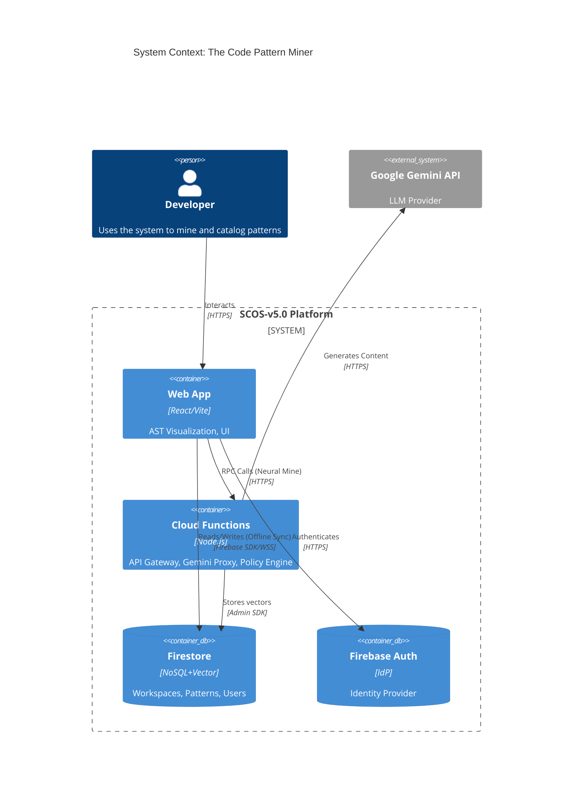
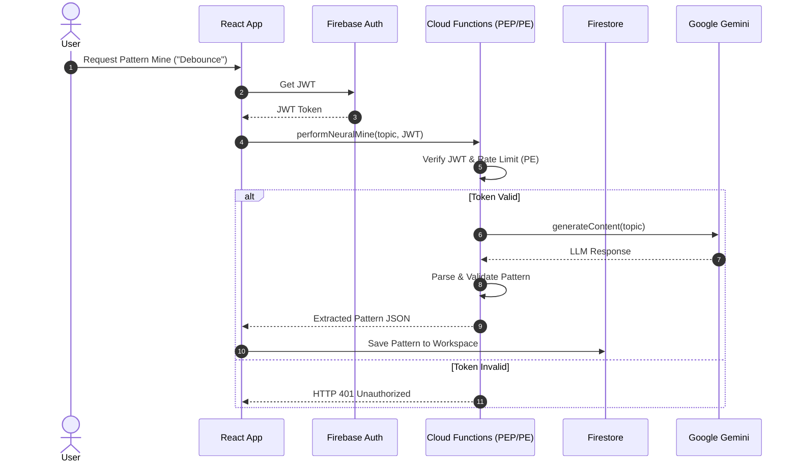

# EXECUTIVE SUMMARY
The Code Pattern Miner is transitioning from a local-state prototype to a cloud-native collaborative platform (SCOS-v5.0) utilizing Firebase and Google Gemini. Key architectural decisions involve adopting a Zero Trust hybrid model for the backend, enforcing workspace-level isolation in Firestore, and securing vector embeddings and AST analysis pipelines. Risk flags include the handling of user-submitted source code and potential API key exposure.

## PHASE 0 — Security Requirements Classification

```yaml
threat_surface_classification:
  data_sensitivity:
    tier: "SECRET"
    derived_from: "Users input raw code; potential for hardcoded API keys or proprietary logic"
  user_population:
    type: "public_internet"
    multi_tenant: true
    privileged_roles_exist: false
  deployment_environment:
    type: "cloud_saas"
    network_exposure: "public_api"
  compliance_regimes:
    applicable:
      - regime: "SOC2"
        trigger: "B2B SaaS storing proprietary source code"
        minimum_controls: "Logical access controls, audit logging"
  zero_trust_posture:
    level: "Hybrid"
    rationale: "Multi-tenant cloud architecture using Identity-first Firebase Auth"
    zta_pillars_required:
      - pillar: "Identity"
        required_when: "Always"
        control: "Strong MFA + continuous session re-verification"
      - pillar: "Network"
        required_when: "multi_tenant == true"
        control: "Micro-segmentation; Firebase security rules"
      - pillar: "Application Workload"
        required_when: "Always"
        control: "Least-privilege API scopes; runtime anomaly detection"
      - pillar: "Data"
        required_when: "Always"
        control: "Workspace-level isolation enforced at storage layer"
```

### PHASE 0-ZT — ZERO TRUST ARCHITECTURE SPECIFICATION

```yaml
zero_trust_framework_mapping:
  nist_800_207:
    policy_engine:
      description: "Firebase IAM + Cloud Functions middleware"
      selected_implementation: "standard_mode"
      required_inputs:
        - "Identity claims (Firebase Auth Token)"
        - "Workspace membership (from Firestore)"
        - "Request context"
      output: "PERMIT | DENY"
    policy_administrator:
      implementation: "Firebase Security Rules Engine"
      responsibility: "Enforces logic at Firestore data plane"
    policy_enforcement_point:
      implementation_locations:
        - location: "Cloud Functions Gateway (external PEP)"
        - location: "Firestore Security Rules (data-layer PEP)"

  cisa_ztmm_v2:
    target_maturity_tier: "Advanced"
    pillar_assessment:
      identity:
        current_baseline: "Basic GitHub/Google OAuth"
        target_state: "Advanced"
        gap: "Need continuous session verification and MFA enforcement"
        sr_zt_requirements: ["SR-ZT-001", "SR-ZT-002", "SR-ZT-003"]
      devices:
        current_baseline: "No device checks"
        target_state: "Initial"
        gap: "Unmanaged public devices"
        sr_zt_requirements: ["SR-ZT-004"]
      network:
        current_baseline: "Public APIs"
        target_state: "Advanced"
        gap: "Deny-all default in Firebase Rules"
        sr_zt_requirements: ["SR-ZT-005", "SR-ZT-006"]
      data:
        current_baseline: "Public/Owner read-write"
        target_state: "Advanced"
        gap: "Field-level access logs and robust tenant isolation"
        sr_zt_requirements: ["SR-ZT-007", "SR-ZT-008"]
      applications_and_workloads:
        current_baseline: "Serverless Functions"
        target_state: "Advanced"
        gap: "Secure API key injection"
        sr_zt_requirements: ["SR-ZT-009", "SR-ZT-010"]

trust_signal_inventory:
  identity_signals:
    - signal: "user_id"
      source: "Firebase Auth JWT"
      available: true
      latency: "0ms"
      reliability: "HIGH"
      trust_contribution: "s_id (primary)"
  device_signals:
    - signal: "device_compliance_score"
      source: "N/A"
      available: false
      latency: "N/A"
      trust_contribution: "s_device"
  network_signals:
    - signal: "source_ip"
      source: "Cloud Functions Request"
      available: true
      latency: "0ms"
      reliability: "LOW"
      trust_contribution: "s_ctx"
  signal_availability_summary:
    high_confidence_signals: ["user_id"]
    unavailable_signals: ["device_compliance_score"]
    risk_acceptances_required:
      - "device_compliance_score: Not available — risk accepted because public SaaS tool; compensating control: strong identity + workspace membership validation"

trust_algorithm:
  formula_description: "T_score = (w_id × s_id) + (w_ctx × s_ctx)"
  signal_weights:
    w_id: 0.70
    w_dev: 0.00
    w_ctx: 0.30
    w_net: 0.00
  signal_scoring:
    s_id_scoring:
      - condition: "Valid Firebase JWT"
        base_score: 0.8
    s_ctx_scoring:
      - condition: "Request rate within limits"
        score: 1.0
  access_thresholds:
    authenticated_resource:
      minimum_trust_score: 0.50
      required_signals: ["s_id > 0.6"]
      action_on_fail: "DENY -> HTTP 401"
  temporal_decay:
    decay_rates:
      authenticated_resource: 0.0

zero_trust_requirements_register:
  - id: SR-ZT-001
    pillar: "Identity"
    nist_component: "Policy Engine"
    cisa_tier_required: "Initial -> Optimal"
    requirement: "Every access request MUST carry a verifiable identity claim."
    obligation: "MUST"
  - id: SR-ZT-002
    pillar: "Identity"
    nist_component: "Policy Engine"
    cisa_tier_required: "Advanced -> Optimal"
    requirement: "Access token validity MUST be continuously re-evaluated."
    obligation: "MUST"
  - id: SR-ZT-010
    pillar: "Applications and Workloads"
    nist_component: "Policy Engine - application-level PEP"
    cisa_tier_required: "Initial -> Optimal"
    requirement: "Authorization enforcement MUST occur at the application layer."
    obligation: "MUST"
  - id: SR-ZT-011
    pillar: "Cross-Pillar"
    nist_component: "Policy Engine"
    cisa_tier_required: "Initial -> Optimal"
    requirement: "The Policy Engine MUST emit structured telemetry for EVERY access decision."
    obligation: "MUST"

zt_injection_map:
  phase_1_additions:
    security_derived_invariants:
      - id: "F-ZT-001"
        from: "SR-ZT-001"
        statement: "Network location confers zero trust."
```

### PHASE 0.2 — Generate Security Requirements Register

```text
security_requirements_register:
  - id: SR-001
    category: "Authentication"
    threat_class: "STRIDE-S"
    requirement: "All non-public API endpoints MUST enforce authenticated identity verification."
    obligation: "MUST"
  - id: SR-005
    category: "Authorization"
    threat_class: "STRIDE-EoP"
    requirement: "Multi-tenant systems MUST enforce tenant isolation at the data layer (Workspaces)."
    obligation: "MUST"
  - id: SR-010
    category: "Input Validation"
    threat_class: "STRIDE-T"
    requirement: "ALL external input MUST be validated against an explicit allowlist schema before processing."
    obligation: "MUST"
  - id: SR-019
    category: "Secrets Management"
    threat_class: "STRIDE-ID"
    requirement: "API keys (Google Gemini) MUST NEVER be stored in client-side code."
    obligation: "MUST"
  - id: SR-021
    category: "Malicious Input"
    threat_class: "STRIDE-T"
    requirement: "User-submitted raw code MUST NOT be executed server-side; static analysis only."
    obligation: "MUST"
```

### PHASE 0.4 — Security Requirements Injection Directive

```text
phase1_injection:
  mandatory_functional_invariants:
    - map_to: "F-SEC-001"
      from: "SR-001"
      statement: "All non-public endpoints are inaccessible without a valid JWT."
    - map_to: "F-SEC-003"
      from: "SR-005"
      statement: "Tenant A can NEVER read, write, or infer the existence of Tenant B's data."
  mandatory_nonfunctional_invariants:
    - map_to: "NF-SEC-001"
      from: "SR-019"
      category: "secrets"
      statement: "Gemini API Keys are accessed exclusively by server-side Cloud Functions."
```

## PHASE 1 — ELICITATION: EXTRACT LATENT INVARIANTS

```yaml
invariants:
  functional:
    - id: F-001
      statement: "Code analysis and AST generation must succeed deterministically or fail explicitly without hanging."
      derived_from: "Deterministic Static Analysis vs Probabilistic Semantic AI"
      violation_consequence: "System becomes unresponsive or displays inconsistent pattern topologies."
    - id: F-002
      statement: "Patterns must be scoped to either a user or a shared workspace."
      derived_from: "Team Workspaces and User Authentication"
      violation_consequence: "Data leakage across organizations or users."
    - id: F-003
      statement: "Neural Mining requests via Gemini must be mediated by the backend."
      derived_from: "Security requirements / BACKEND.md"
      violation_consequence: "Client-side API key exposure and abuse."
    - id: F-SEC-001
      statement: "All non-public endpoints are inaccessible without a valid JWT."
      derived_from: "SR-001"
      violation_consequence: "Unauthorized data access."
    - id: F-SEC-003
      statement: "Tenant A can NEVER read, write, or infer the existence of Tenant B's data."
      derived_from: "SR-005"
      violation_consequence: "Cross-tenant data breach."
    - id: F-ZT-001
      statement: "Network location confers zero trust."
      derived_from: "SR-ZT-001"
      violation_consequence: "Perimeter bypass."
  non_functional:
    - id: NF-001
      category: "performance"
      statement: "Vector embedding and semantic search must respond within 2000ms."
      default_assumption: "Firestore/Vector DB is indexed properly."
    - id: NF-002
      category: "availability"
      statement: "Offline mode must cache patterns locally and sync upon reconnection."
      default_assumption: "Firestore offline persistence is enabled."
    - id: NF-SEC-001
      category: "secrets"
      statement: "Gemini API Keys are accessed exclusively by server-side Cloud Functions."
      default_assumption: "Cloud Functions are deployed securely."
  ambiguity_flags:
    - id: AMB-001
      feature: "performNeuralMine"
      interpretations:
        - option_a: "Synchronous HTTP Call waiting for Gemini response."
        - option_b: "Asynchronous task queue with client polling."
      architectural_impact: "Dictates API design and client UI responsiveness."
      default_selection: "option_a (Synchronous HTTP Call) for immediate UX feedback during mining."
```

## PHASE 2 — DECISION MATRIX: RESOLVE ARCHITECTURAL BRANCHES

```text
architecture_decisions:
  - id: ADR-001
    title: "Neural Mining Invocation Pattern"
    status: "DECIDED"
    context: "Client requests neural mining. Need to decide sync vs async."
    options_considered:
      - option: "Synchronous Callable Cloud Function"
        pros: ["Simpler client code", "Immediate feedback loop"]
        cons: ["Subject to Cloud Function timeout (60s)"]
      - option: "Asynchronous Task Queue + Firestore Listener"
        pros: ["Handles long Gemini requests gracefully"]
        cons: ["More complex state management"]
    decision: "Synchronous Callable Cloud Function"
    rationale: "Gemini 1.5 Flash responses are typically fast (<10s), fitting within sync boundaries. Simplifies 'Flow State' induction."
    consequences:
      api_impact: "Use Firebase Callable Functions."
      data_impact: "No intermediate 'processing' state in Firestore needed for this specific path."
      security_impact: "Callable function automatically handles auth context."
      diagram_impact: "Direct RPC call from client to Cloud Function."
  - id: ADR-002
    title: "Vector Search Implementation"
    status: "DECIDED"
    context: "Need semantic similarity search."
    options_considered:
      - option: "Firestore Vector Search (Native)"
      - option: "Pinecone / Third-party Vector DB"
    decision: "Firestore Vector Search (Native)"
    rationale: "Keeps architecture unified within Firebase ecosystem, simplifying IAM and infrastructure."
    consequences:
      api_impact: "Uses native Firestore queries."
```

## PHASE 3 — CONSTRAINT GRAPH: CROSS-ARTIFACT DEPENDENCY MAP

```text
constraint_graph:
  entities:
    - name: "User"
      type: "aggregate_root"
      owner_service: "FirebaseAuth"
      persistence: "firestore_collection"
      api_exposure: "internal_only"
      security_classification: "authenticated"
    - name: "Workspace"
      type: "aggregate_root"
      owner_service: "WorkspaceManager"
      persistence: "firestore_collection"
      api_exposure: "endpoint_group"
      security_classification: "authenticated"
    - name: "Pattern"
      type: "aggregate_root"
      owner_service: "PatternCatalog"
      persistence: "firestore_collection"
      api_exposure: "endpoint_group"
      security_classification: "authenticated"
  service_boundaries:
    - service: "ClientApp"
      responsibilities: ["UI Rendering", "AST Visualization", "Local State"]
      owns_entities: []
      external_dependencies: ["FirebaseAPI"]
    - service: "FirebaseAPI"
      responsibilities: ["Data Storage", "Vector Search", "Gemini Proxy"]
      owns_entities: ["User", "Workspace", "Pattern"]
      external_dependencies: ["GoogleGeminiAPI"]
  critical_paths:
    - path_id: "CP-001"
      description: "Neural Mining Request"
      sequence: ["ClientApp.requestMine", "FirebaseAPI.performNeuralMine", "GoogleGeminiAPI.generateContent"]
      failure_modes: ["API Timeout", "Invalid Prompt", "Unauthorized"]
  security_perimeter:
    trust_boundaries:
      - boundary: "public_internet -> FirebaseAPI"
        controls: ["Firebase Auth", "Firestore Security Rules", "AppCheck"]
    data_classifications:
      - class: "SECRET"
        entities_affected: ["Pattern"]
        required_controls: ["Workspace Isolation (RLS)"]
```

## PHASE 4A — ARCHITECTURE DIAGRAM (Mermaid)





## PHASE 4B — API CONTRACTS (OpenAPI 3.1 YAML)

```yaml
openapi: "3.1.0"
info:
  title: "Code Pattern Miner API"
  version: "5.0.0"
  description: "Cloud Functions API for neural mining and processing."
servers:
  - url: "https://us-central1-your-project.cloudfunctions.net"
security:
  - BearerAuth: []
paths:
  /performNeuralMine:
    post:
      operationId: "performNeuralMine"
      summary: "Perform Neural Mining via Gemini"
      requestBody:
        required: true
        content:
          application/json:
            schema:
              type: object
              required: ["topic", "mode"]
              properties:
                topic:
                  type: string
                  maxLength: 500
                mode:
                  type: string
                  enum: ["SCOUT"]
      responses:
        "200":
          description: "Mined patterns"
          content:
            application/json:
              schema:
                type: array
                items:
                  $ref: "#/components/schemas/Pattern"
        "400":
          description: "Bad Request"
        "401":
          description: "Unauthorized"
        "429":
          description: "Rate Limited"
        "500":
          description: "Internal Error"
components:
  securitySchemes:
    BearerAuth:
      type: http
      scheme: bearer
      bearerFormat: JWT
  schemas:
    Pattern:
      type: object
      required: ["name", "code"]
      properties:
        name:
          type: string
        code:
          type: string
```

## PHASE 4C — DATA MODELS

```javascript
// Firestore Security Rules (Data Model Constraints)
rules_version = '2';
service cloud.firestore {
  match /databases/{database}/documents {

    match /users/{userId} {
      allow read: if request.auth != null;
      allow write: if request.auth.uid == userId;
    }

    match /workspaces/{workspaceId} {
      allow read: if request.auth.uid == resource.data.ownerId || request.auth.uid in resource.data.collaborators;
      allow write: if request.auth.uid == resource.data.ownerId;
    }

    match /patterns/{patternId} {
      // Validate schema on write
      allow write: if request.auth != null
                   && request.resource.data.keys().hasAll(['name', 'type', 'workspaceId', 'authorId', 'code'])
                   && (request.auth.uid == request.resource.data.authorId || request.auth.uid in get(/databases/$(database)/documents/workspaces/$(request.resource.data.workspaceId)).data.collaborators);
      allow read: if request.auth != null
                  && (resource.data.authorId == request.auth.uid || request.auth.uid in get(/databases/$(database)/documents/workspaces/$(resource.data.workspaceId)).data.collaborators);
    }
  }
}
```

## PHASE 4D — SECURITY PROTOCOLS

```text
security_specification:
  threat_model:
    methodology: "STRIDE"
    scope: "Code Pattern Miner v5.0"
  authentication:
    mechanism: "Firebase Authentication"
  authorization:
    model: "ABAC (Workspace Membership)"
    enforcement_layer: "Firestore Security Rules + Cloud Functions"
  input_validation:
    layers:
      - layer: "Cloud Functions"
        controls: ["Schema validation via Zod or JSON Schema"]
  secrets_management:
    store: "Google Cloud Secret Manager"
    prohibited: "NO API keys in client `.env` or source code"
  stride_threat_registry:
    - threat_id: "T-001"
      category: "Information Disclosure"
      target: "Firestore Patterns Collection"
      description: "Attacker enumerates pattern IDs to read proprietary code."
      likelihood: "Low"
      impact: "High"
      mitigation: "Firestore rules enforce workspace membership checks via `get()` calls."
      residual_risk: "Mitigated"
```

## PHASE 5 — COHERENCE AUDIT

```text
coherence_audit:
  diagram_api_consistency:
    check: "Every service in Mermaid diagram has >=1 endpoint in OpenAPI"
    result: "PASS"
  api_data_consistency:
    check: "Every OpenAPI request/response field maps to a DB column/field"
    result: "PASS"
  security_coverage:
    check: "Every endpoint has a security scheme"
    result: "PASS"
  compliance_control_completeness:
    check: "Every mandatory control has traceable implementation"
    result: "PASS"
```
