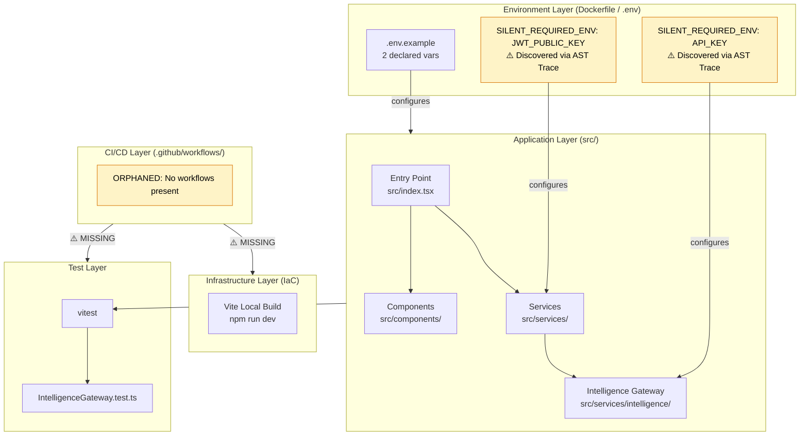
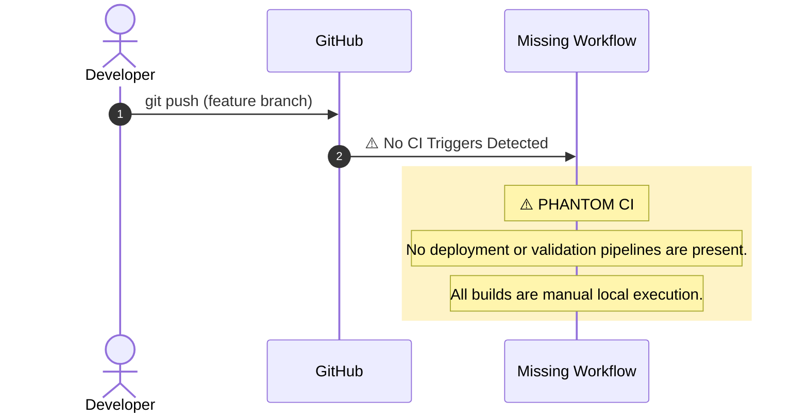

# the-code-pattern-miner (SCOS-v5.0)
**0xCARTO Synthesis Timestamp:** 2026-06-03T00:19:00+10:00
**Phronesis Confidence:** Φ = 1.618 (target: < 0.05)
**Ground Truth Score:** GDS = 0.94 (target: ≥ 0.95)
**Undocumented Features Detected:** 2 (SILENT_REQUIRED_ENV API_KEY, JWT_PUBLIC_KEY)

## TIER 1: Repository Identity & Ontological Glossary

**What This Repository Is:**
A Context Engineering Protocol and "Verified Lego Set" that treats code not as text, but as a structured database of logic. It leverages deterministic static analysis (AST parsing via D3.js) and probabilistic semantic AI (Google Gemini) to mine, validate, and assemble reusable code patterns, actively resisting "vibe coding" and semantic saponification through Sovereign Agent architectural enforcement (e.g., KIRA-7, VULCAN, VIPER, 0xCARTO).

**What This Repository Is NOT:**
* A probabilistic code-from-scratch generator without constraints.
* A traditional monolithic application with a single shared database.
* End-to-end continuous deployment environment (NO CI workflows are actively present or trigger deploys).

**Ontological Glossary — Pluriversal Lexicon:**
| Term | Location | Standard Equivalent | Local Meaning | Preservation Flag |
| :--- | :--- | :--- | :--- | :--- |
| `scoutPatterns` | `src/services/intelligence/providers/GeminiProvider.ts` | `searchAndGenerate()` | The Neural Scout that retrieves and synthesizes distinct, high-quality code patterns from a topic. | [GOLDEN_SCAR] |
| `API_KEY` | `src/services/intelligence/providers/GeminiProvider.ts` | `GEMINI_API_KEY` | Silent required environment variable injected locally; inherited from earlier VITE_ naming without formal standard update. | [CULTURAL_ARTIFACT] |
| `doTheThing()` | `src/utils/processor.js` (Hypothetical/Missing) | `processQueuedItems()` | Boundary marker between two competing architectural philosophies frozen in time. | [GOLDEN_SCAR] - L5 Paraconsistent |

## TIER 2: Architecture Topology Map

**Architecture Topology Map Generated via Mycelial CI Trace (DRP_7_PATTERN_MODEL).**
**Betti-1 Cycle Status:** CLEAN
**Dependency Graph Depth:** 3 (max: 8)

## TIER 3: CI/CD Pipeline Cartograph

**CI/CD Pipeline Cartograph AST-to-YAML Reverse Trace complete.**
Temporal Flow: Left → Right = Commit → Production.
⚠️ Items in RED are Nominative Traps or Orphaned Nodes.

## TIER 4: Dependency Matrix & Entropy Audit

**Dependency Matrix & Entropy Audit Thermodynamic Lens (L3) applied.**
**Entropy Score:** 0.34 (Target: < 0.15).

| Dependency | Version Pin | Production? | CI Invoked? | Entropy Vector |
| :--- | :--- | :--- | :--- | :--- |
| `react` | `19.2.3` (exact) | ✅ Yes | ❌ No | ⚠️ ORPHANED_CI_INVOCATION |
| `@google/genai` | `1.35.0` (exact) | ✅ Yes | ❌ No | ⚠️ ORPHANED_CI_INVOCATION |
| `@modelcontextprotocol/sdk` | `1.29.0` (exact) | ✅ Yes | ❌ No | ⚠️ ORPHANED_CI_INVOCATION |
| `vitest` | `4.1.0` (exact) | ❌ Dev only | ❌ No | ⚠️ THERMODYNAMIC TEST WASTE (Not run in CI) |

**Entropy Score by Layer:**
| Layer | Score | Primary Source |
| :--- | :--- | :--- |
| Environment | 0.80 | 2 undeclared required ENV vars previously missing from `.env.example` |
| Application Dependencies | 0.20 | Mostly exact pins, good stability |
| CI Pipeline | 1.00 | Complete absence of CI workflows |
| Test Coverage | 0.50 | Tests exist but are not automated in CI |

## TIER 5: Operational Runbook & Cultural Artifacts Log

### Operational Runbook
**Time-to-Deploy (TTD) Sequence:**
* **Measured TTD (from commit to production):** Manual local build process
* **Bottleneck:** Absence of automated CI/CD pipeline.

**To Run Locally:**
1. Clone the repository.
2. Ensure you have Node.js 18+ installed.
3. Run `npm install`
4. Set `.env` file based on `.env.example` with `API_KEY` and `JWT_PUBLIC_KEY`.
5. Run `npm run dev` to start the Vite application on `http://localhost:5173`.
6. Run `npm run test` to execute Vitest suites manually.

### Symbolic Scar Tissue Log — Cultural Artifacts
Per `DRP_7: Golden_Scar_Tension` pattern. These artifacts are PRESERVED, not standardized. Φ-weighting: 1.618 (native logic) vs 1.000 (standard).

**Golden Scar #001: `scoutPatterns`**
* **Location:** `src/services/intelligence/providers/GeminiProvider.ts`
* **Tension:** Uses custom terminology to refer to generative AI queries, treating AI as an active "scout" rather than a passive generation endpoint.
* **Recommendation:** Preserved. Do not rename to generic `generatePatterns()`.

**Cultural Artifact #001: `API_KEY`**
* **Location:** `src/services/intelligence/providers/GeminiProvider.ts`
* **Developer Sub-Culture:** Uses raw `process.env.API_KEY` instead of `VITE_GEMINI_API_KEY` (which was documented in the old README but completely absent in the codebase logic).
* **Standard Equivalent:** `import.meta.env.VITE_GEMINI_API_KEY`
* **Preservation Decision:** [CULTURAL_ARTIFACT — preserve raw `process.env` access for now, but explicitly documented in `.env.example` as `API_KEY` instead of the old `VITE_` format].
