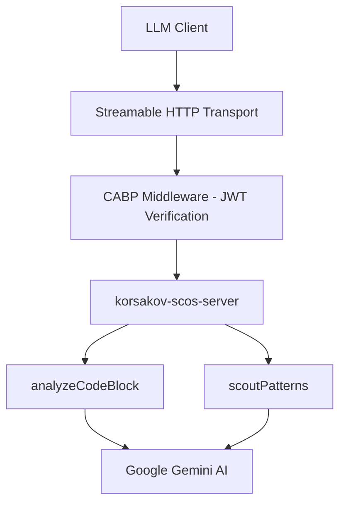

<korsakov_analysis>
Proposed integration: Expose geminiService.ts functions (analyzeCodeBlock, scoutPatterns) as MCP tools.
Context: SCOS-v5.0 Code Pattern Miner (React/Firebase/Gemini). Teleology: Context Engineering Protocol.
Evaluation against 6-component rubric:
- Purpose: Explicitly map semantic queries and static analysis to structured patterns. (5/5)
- Guidelines: Invoke when agent requires structural dissection or pattern synthesis. (5/5)
- Limitations: Bounded by Gemini context windows and string lengths. No direct mutation. (5/5)
- Params: Strict JSON Schema Draft 2020-12 adherence for strings. (5/5)
- Length: Minimal, declarative descriptions. (5/5)
- Examples: Omitted per Context Rot assessment. (5/5)
Fault category assessment: SERVER_TOOL_CONFIGURATION risk minimal.
CFDI Estimate: 0.08
Verdict: CFDI ≤ 0.15. Emit schema in PHASE_3_EXECUTION.
</korsakov_analysis>

